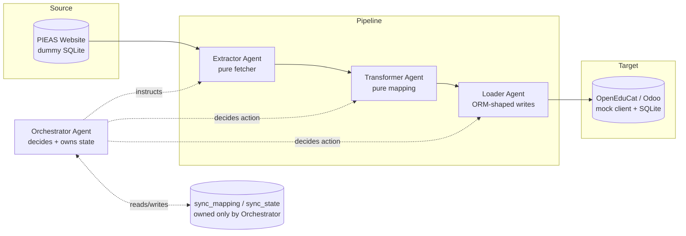
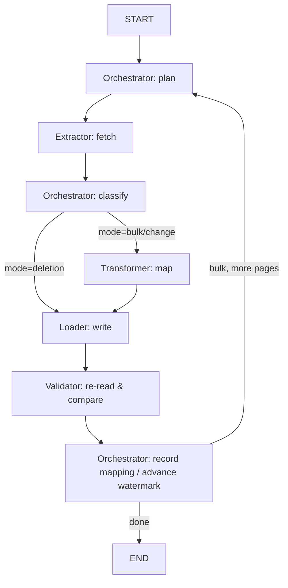

# OpenEdu Orchestrator

Agentic multi-agent data synchronization system: **PIEAS Website → OpenEduCat (Odoo) ERP**.

This is a working implementation of the design in `PIEAS_OpenEduCat_MultiAgent_Report 2.pdf` —
a one-time bulk migration plus an ongoing, agentic sync (change detection + deletion detection)
between a source system with no API (PIEAS) and a target ERP with a well-documented ORM/API
surface (OpenEduCat, built on Odoo). This build runs entirely against **dummy data and a mock
OpenEduCat backend** so the whole system can be exercised and tested without a real PIEAS
database or a real Odoo/OpenEduCat install — see [Scaling to the real systems](#scaling-to-the-real-systems)
for exactly what would change to point it at production.

## Architecture

Four agents, each with one job, exactly per the report's design principle ("one agent, one clear
job") — no fifth Monitor agent, because that responsibility fully overlaps with the Orchestrator's:



| Agent | Responsibility | Module |
|---|---|---|
| **Extractor** | The only agent that ever touches the PIEAS database. Pure fetcher — given an instruction (`fetch_changed`, `fetch_page`, `fetch_ids`), returns raw rows and holds no state between calls. | [`agents/extractor.py`](src/openedu_orchestrator/agents/extractor.py) |
| **Transformer** | Pure function mapping a PIEAS-shaped dict to an OpenEduCat-shaped dict, per entity type. No I/O, no decisions. | [`agents/transformer.py`](src/openedu_orchestrator/agents/transformer.py) |
| **Loader** | Writes into OpenEduCat via an ORM-shaped client (`create` / `write` / `write active=False`). Executes exactly the action it's told. | [`agents/loader.py`](src/openedu_orchestrator/agents/loader.py) |
| **Orchestrator** | The only decision-maker. Owns `sync_mapping`/`sync_state` exclusively, decides what to fetch and when, classifies each record `create`/`update`/`unchanged`, and (in the deletion cycle) `archive`. | [`agents/orchestrator.py`](src/openedu_orchestrator/agents/orchestrator.py) |
| **Validator** *(optional, Section 3.4)* | Re-reads a record after a Loader write and confirms it matches. Observes after the fact; never blocks or retries a write itself. | [`agents/validator.py`](src/openedu_orchestrator/agents/validator.py) |

All four (plus the optional Validator) are wired together as **one LangGraph `StateGraph`**
([`graph.py`](src/openedu_orchestrator/graph.py)) that serves all three cycles the report
describes — `state["mode"]` branches each node, since bulk migration, the change cycle, and the
deletion cycle all share the same Extractor → Transformer → Loader pipeline and differ only in
what the Orchestrator asks the Extractor to fetch and what it does with the result:



### Three separate databases, on purpose

The separation of concerns is enforced at the storage layer, not just by convention:

- **`data/pieas.db`** — the dummy PIEAS website. Only `ExtractorAgent` opens this file.
- **`data/openeducat_mock.db`** — the mock OpenEduCat/Odoo target, exposing `create` / `write` /
  `search_read` / `read` — the same method shapes Odoo's real XML-RPC ORM exposes. Only
  `LoaderAgent` (and the read-only `ValidationAgent`) touch this.
- **`data/orchestrator_state.db`** — `sync_mapping` (pieas_id ↔ openeducat_id per entity type,
  with a content hash) and `sync_state` (the per-entity watermark). Only `OrchestratorAgent`
  imports `sync_store.py` at all.

No other agent module even has a code path to open the "wrong" database.

### Design decisions carried over from the report

- **Change detection**: timestamp watermark (`last_updated > :watermark`), not a dirty-flag
  column — avoids the reset race condition the report identifies in Section 5.1.
- **Deletion detection**: a separate, less-frequent cycle that fetches the *full* current ID
  list from PIEAS and diffs it against `sync_mapping` locally (a set-difference, equivalent to
  the report's `LEFT JOIN ... WHERE ... IS NULL`) — because a filtered `last_updated` query
  structurally can never see a row that no longer exists (Section 5.3).
- **Deletion handling**: archive (`active = False`), not hard delete — preserves history and is
  reversible if a "deletion" was actually a rename (Section 5.4).
- **Writes go through an ORM-shaped interface**, never raw SQL against the target — mirrors the
  report's decision to use XML-RPC against Odoo's ORM rather than direct PostgreSQL writes
  (Section 7), so validation/computed-field logic would still run on a real instance.

### Two refinements beyond the report's literal text

- **Watermark advances by max `last_updated` actually processed**, not wall-clock `NOW()` — safer
  against a row changing again mid-run than the report's literal `Listing 7`.
- **Content-hash check on top of the watermark**: a record whose `last_updated` was touched but
  whose business fields are identical classifies as `unchanged` rather than `update`, so bulk
  migration can also seed the watermark (see `graph.py`'s `finalize_node`) without the first
  change cycle afterwards re-writing everything it just migrated.

### Known, intentional characteristic

Once a PIEAS record is permanently deleted, every subsequent deletion cycle will still classify
it as "missing" (since `sync_mapping` still holds it) and re-issue an archive write. This is
harmless — archiving an already-inactive record is a no-op in the mock client, exactly as it
would be against real Odoo — but it does mean the deletion cycle's `archived` count reflects
"archive calls issued," not "newly discovered deletions." The report's schema doesn't define a
way to mark a mapping as "already handled," and extending it to do so was left out to avoid
inventing a field the report doesn't specify.

## Project layout

```
src/openedu_orchestrator/
    config.py              # DB paths, entity types, schedule constants
    models.py               # pydantic schemas (PieasStudent/Faculty/Course, RunReport, ...)
    state.py                 # LangGraph PipelineState TypedDict
    pieas_source.py          # dummy PIEAS DB (schema, seeding/mutation/read helpers)
    openeducat_client.py     # mock Odoo/OpenEduCat ORM-shaped client
    sync_store.py            # sync_mapping / sync_state -- Orchestrator-only
    seed.py                  # deterministic Faker-based dummy data generator
    graph.py                 # LangGraph StateGraph wiring + run_cycle()
    cli.py                   # click CLI: seed / migrate / sync / deletion-check / mutate / status / demo
    agents/
        extractor.py
        transformer.py
        loader.py
        orchestrator.py
        validator.py
tests/                       # pytest suite (57 tests) -- see below
```

## Setup

```bash
python -m venv .venv
.venv/Scripts/pip install -r requirements.txt
.venv/Scripts/pip install -e .
```

## Running it

```bash
# One command that walks through the whole report: seed -> bulk migrate ->
# simulate PIEAS activity -> change cycle -> deletion cycle -> status.
python -m openedu_orchestrator demo

# Or drive each phase yourself:
python -m openedu_orchestrator seed                       # (re)create dummy PIEAS data
python -m openedu_orchestrator migrate --entity all        # bulk migration (once, per entity)
python -m openedu_orchestrator mutate --entity student --update 3 --insert 2 --delete 1
python -m openedu_orchestrator sync --entity all            # change cycle (run on a schedule)
python -m openedu_orchestrator sync --entity all --loop --interval 1800   # keep running every 30 min
python -m openedu_orchestrator deletion-check --entity all   # deletion cycle (run less often)
python -m openedu_orchestrator status                        # row counts, mapping counts, watermarks
```

`--entity` accepts `student`, `faculty`, `course`, or `all`.

## Tests

```bash
.venv/Scripts/python -m pytest -v
```

57 tests across unit-level agent behaviour (`test_extractor.py`, `test_transformer.py`,
`test_loader.py`, `test_orchestrator_classification.py`, `test_validator.py`), the storage
layers (`test_pieas_source.py`, `test_openeducat_client.py`, `test_sync_store.py`), each cycle
through the real LangGraph pipeline (`test_graph_bulk_migration.py`, `test_graph_change_sync.py`,
`test_graph_deletion_cycle.py` — including pagination, idempotency, and watermark monotonicity),
and a full cross-entity lifecycle test (`test_end_to_end.py`).

## Scaling to the real systems

The design was built so this swap is localized to two files:

1. **`pieas_source.py`** — replace the SQLite connection with whatever PIEAS's real database
   is (or a scraping/read layer, if PIEAS truly has no DB access) exposing the same
   `fetch_changed` / `fetch_page` / `fetch_ids` shapes. `ExtractorAgent` doesn't change.
2. **`openeducat_client.py`** — replace the SQLite-backed methods with real
   `xmlrpc.client.ServerProxy` calls against a self-hosted Odoo + OpenEduCat instance's
   `common`/`object` endpoints (`execute_kw(db, uid, password, model, 'create'/'write'/'search_read', args)`),
   keeping the same `create` / `write` / `archive` / `search_read` / `read` method signatures.
   `LoaderAgent` and `ValidationAgent` don't change.

Everything else — the Orchestrator's decision logic, the Transformer's field mappings, the
LangGraph wiring, the CLI, the tests' structure — carries over unchanged, because the whole
system was built against the report's agent boundaries rather than against SQLite specifically.

## Reference

- [OpenEduCat ERP](https://github.com/openeducat/openeducat_erp) — the real Odoo module this
  project's mock target stands in for.
