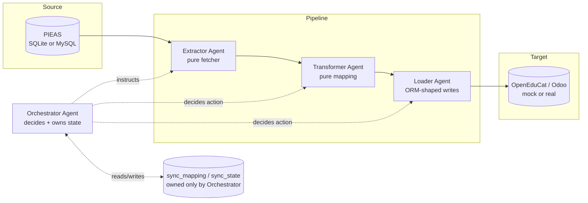
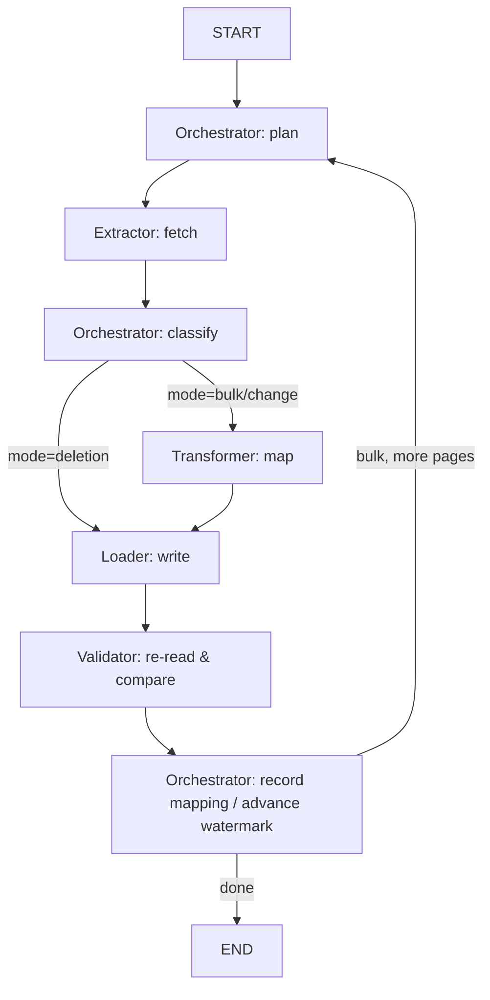

# OpenEdu Orchestrator

[](https://github.com/SubhanSandhu312/OpenEdu-Orchestrator/actions/workflows/ci.yml)

Agentic multi-agent data synchronization system: **PIEAS Website → OpenEduCat (Odoo) ERP**.

This is a working implementation of the design in `PIEAS_OpenEduCat_MultiAgent_Report 2.pdf` —
a one-time bulk migration plus an ongoing, agentic sync (change detection + deletion detection)
between a source system with no API (PIEAS) and a target ERP with a well-documented ORM/API
surface (OpenEduCat, built on Odoo).

The build now runs against **both** a mock target and a **real local Odoo 19.0 + OpenEduCat 19.0
instance**, and against **two different PIEAS backing stores** (dummy SQLite, and a real MySQL
database — deliberately a different database technology than OpenEduCat's own Postgres, to keep
the cross-system heterogeneity honest). Everything is generalized behind a formal `SourceAdapter`
contract, so pointing the pipeline at a second university's source system is a matter of writing
one new adapter module, not touching the pipeline itself — see
[Multi-source generalization](#multi-source-generalization).

## Architecture

Four agents, each with one job, exactly per the report's design principle ("one agent, one clear
job") — no fifth Monitor agent, because that responsibility fully overlaps with the Orchestrator's:



| Agent | Responsibility | Module |
|---|---|---|
| **Extractor** | The only agent that ever touches the PIEAS source. Pure fetcher — given an instruction (`fetch_changed`, `fetch_page`, `fetch_ids`), returns raw rows and holds no state between calls. Works against any module implementing `SourceAdapter`. | [`agents/extractor.py`](src/openedu_orchestrator/agents/extractor.py) |
| **Transformer** | Pure function mapping a source-shaped dict to a target-shaped dict, per entity type. No I/O, no decisions. Against the mock, a hand-written mapping; against the real target, a compiled, human-reviewed mapping (see [Mapping authoring](#mapping-authoring)). | [`agents/transformer.py`](src/openedu_orchestrator/agents/transformer.py) |
| **Loader** | Writes into OpenEduCat via an ORM-shaped client (`create` / `write` / `write active=False`). Executes exactly the action it's told. The real client's RPC calls are wrapped in retry/backoff for transient network failures. | [`agents/loader.py`](src/openedu_orchestrator/agents/loader.py) |
| **Orchestrator** | The only decision-maker. Owns `sync_mapping`/`sync_state` exclusively, decides what to fetch and when, classifies each record `create`/`update`/`unchanged`, and (in the deletion cycle) `archive`. Scoped by `source_system`, so two source systems never collide over the same mapping/watermark rows. | [`agents/orchestrator.py`](src/openedu_orchestrator/agents/orchestrator.py) |
| **Validator** *(optional, Section 3.4)* | Re-reads a record after a Loader write and confirms it matches. Observes after the fact; never blocks or retries a write itself. | [`agents/validator.py`](src/openedu_orchestrator/agents/validator.py) |

All four (plus the optional Validator) are wired together as **one LangGraph `StateGraph`**
([`graph.py`](src/openedu_orchestrator/graph.py)) that serves all three cycles the report
describes — `state["mode"]` branches each node, since bulk migration, the change cycle, and the
deletion cycle all share the same Extractor → Transformer → Loader pipeline and differ only in
what the Orchestrator asks the Extractor to fetch and what it does with the result:



Every `run_cycle()` call also emits structured JSON log events (`cycle_started`,
`cycle_completed`) alongside the human-readable CLI output — see
[Structured logging](#structured-logging).

### Multi-source generalization

`source_adapter.py` defines a runtime-checkable `SourceAdapter` Protocol
(`get_connection` / `fetch_changed` / `fetch_page` / `fetch_ids`); `source_registry.py` maps a
`--source` name to the module implementing it. Every adapter aliases its own primary key to
`source_id` and its own watermark column to `last_updated` in its fetch functions' output — the
one piece of wire-format discipline that keeps `OrchestratorAgent`, `sync_store.py`, and the
Loader/Validator entirely source-agnostic (no `pieas_id` string appears anywhere in the generic
pipeline).

Three adapters exist today:

- **`pieas_source.py`** — dummy SQLite PIEAS, `--source pieas` (default).
- **`pieas_source_mysql.py`** — a real MySQL-backed PIEAS, `--source pieas-mysql`. Same logical
  `source_system` (`"pieas"`) as the SQLite adapter — they're two physical backing stores for one
  logical source, sharing the same `sync_mapping`/watermark rows.
- **`example_univ_source.py`** — a second, genuinely different logical source system, proving the
  `source_system` scoping actually isolates two universities from each other.

### Real target: Odoo + OpenEduCat

`openeducat_client.py` has two implementations of the same method surface
(`create`/`write`/`archive`/`read`/`search_read`/`search_count`):

- **`OpenEduCatClient`** — the SQLite-backed mock the test suite runs against.
- **`OdooXmlRpcClient`** — real XML-RPC against a local Odoo 19.0 + OpenEduCat 19.0 instance.
  External-ID tracking uses Odoo's own `ir.model.data` mechanism (no foreign-system-key field
  needed on the real models). RPC calls are wrapped in exponential backoff for transient network
  failures (connection reset, timeout, protocol errors) — never for Odoo's own application-level
  rejections (`xmlrpc.client.Fault`, e.g. a failed validation), since retrying those would just
  repeat the same rejection.

`--target mock` / `--target real` selects between them on every CLI command that talks to the
target. Course maps to `op.course` on the mock but real OpenEduCat's `op.subject` (a degree
program, not `op.course`, is the mock-only simplification) — `cli.py`'s `REAL_MODEL_FOR_ENTITY`
handles that divergence.

### Mapping authoring

`mapping_authoring.py` uses Gemini (`GEMINI_API_KEY`) to propose a field-by-field mapping from a
sample of source records to a real target model's actual fields (introspected live via
`fields_get`), producing a structured `MappingProposal` — disclosed assumptions and unmapped
fields included, not silently dropped. Proposals are written to `mappings/*_gemini_draft.json`
as an honest historical record; a human reviews and approves the working copy at
`mappings/*_pieas.json`, which `compile_mapping()` turns into the actual transform function used
against `--target real`.

### Entity types, and cross-entity dependencies

Four entity types: `student`, `faculty`, `course`, and `mark` (exam/quiz results — the source
report's own worked example of an ongoing change).

`ENTITY_TYPES` in [`config.py`](src/openedu_orchestrator/config.py) is **order-significant**.
A mark is a *relational* record: it is meaningless without the student and subject it points at,
both of which must already exist on the target. `mark` is therefore last, which is what makes
`--entity all` work in a single pass. The source tables declare real foreign keys with
`ON DELETE CASCADE`, so deleting a student genuinely removes their marks — and the deletion
cycle then archives those marks on the target too.

### Reference data (shared records)

Some source values don't name a field on the target — they name a *shared record* that many
source rows point at. `department` isn't a field on real `op.student` at all; it's reached via
an `op.student.course` enrollment → `op.batch` → `op.course` chain.

These use a `reference` handling in the mapping, which mirrors the existing `external_id`
sentinel: the compiled transform passes the value through under a `__ref__` prefix, and
[`real_target_reference_data.py`](src/openedu_orchestrator/real_target_reference_data.py)
resolves it get-or-create style. Placement is deliberate — resolving means *talking to the
target*, which the Transformer can't do without losing its purity, and the Loader must stay dumb,
so it lives in the client, which is the target adapter.

For marks, the student and subject are resolved through the **same `ir.model.data` external IDs
the pipeline registered when it synced them** — so cross-entity references need no second mapping
store. A mark whose student isn't synced yet fails with an error naming the problem, rather than
writing a dangling foreign key.

Approved mappings may also carry `constant_fields` for a required target field with no source
equivalent (e.g. `op.exam.attendees.status`). This is deliberately *not* part of the LLM's
`MappingProposal` schema: the tool's job is to **report** such a field under
`unmapped_required_target_fields`, while choosing the constant stays a human review decision.

### Three separate local databases, on purpose

The separation of concerns is enforced at the storage layer, not just by convention:

- **`data/pieas.db`** — the dummy PIEAS website (only relevant for `--source pieas`). Only
  `ExtractorAgent` opens this file; the MySQL/other adapters never touch it.
- **`data/openeducat_mock.db`** — the mock OpenEduCat/Odoo target (only relevant for
  `--target mock`), exposing the same method shapes Odoo's real XML-RPC ORM exposes. Only
  `LoaderAgent` (and the read-only `ValidationAgent`) touch this.
- **`data/orchestrator_state.db`** — `sync_mapping` (source_id ↔ openeducat_id per
  `(source_system, entity_type)`, with a content hash) and `sync_state` (the per-source,
  per-entity watermark). Only `OrchestratorAgent` imports `sync_store.py` at all.

No other agent module even has a code path to open the "wrong" database.

### Design decisions carried over from the report

- **Change detection**: timestamp watermark (`last_updated > :watermark`), not a dirty-flag
  column — avoids the reset race condition the report identifies in Section 5.1.
- **Deletion detection**: a separate, less-frequent cycle that fetches the *full* current ID
  list from the source and diffs it against `sync_mapping` locally (a set-difference, equivalent
  to the report's `LEFT JOIN ... WHERE ... IS NULL`) — because a filtered `last_updated` query
  structurally can never see a row that no longer exists (Section 5.3).
- **Deletion handling**: archive (`active = False`), not hard delete — preserves history and is
  reversible if a "deletion" was actually a rename (Section 5.4).
- **Writes go through an ORM-shaped interface**, never raw SQL against the target — mirrors the
  report's decision to use XML-RPC against Odoo's ORM rather than direct PostgreSQL writes
  (Section 7), so validation/computed-field logic still runs, including against the real instance.

### Two refinements beyond the report's literal text

- **Watermark advances by max `last_updated` actually processed**, not wall-clock `NOW()` — safer
  against a row changing again mid-run than the report's literal `Listing 7`.
- **Content-hash check on top of the watermark**: a record whose `last_updated` was touched but
  whose business fields are identical classifies as `unchanged` rather than `update`, so bulk
  migration can also seed the watermark (see `graph.py`'s `finalize_node`) without the first
  change cycle afterwards re-writing everything it just migrated.

### Known, intentional characteristics

- Once a source record is permanently deleted, every subsequent deletion cycle will still
  classify it as "missing" (since `sync_mapping` still holds it) and re-issue an archive write.
  This is harmless — archiving an already-inactive record is a no-op — but the deletion cycle's
  `archived` count reflects "archive calls issued," not "newly discovered deletions."
- `sync_mapping` scopes by `source_system`, not by target — there's exactly one live target per
  deployment in this design. Running `reconcile`/`sync` with a different `--target` than what
  actually wrote the current mapping rows (switching mock↔real mid-session, as this test build
  lets you do) looks up the stored `openeducat_id` in the wrong target's id space and reports
  false drift — a mismatched invocation, not a real bug.
- `pieas` and `pieas-mysql` share one `source_system`, so a record synced only from one physical
  backend will show as drift when reconciled against the other's ID list — a real, expected
  consequence of that design choice, not a bug in `reconcile` itself.

## Project layout

```
src/openedu_orchestrator/
    config.py                 # DB paths, entity types, schedule constants, env-var-backed credentials
    logging_config.py         # structured (JSON) logging setup
    models.py                 # pydantic schemas (PieasStudent/Faculty/Course, RunReport, ...)
    state.py                  # LangGraph PipelineState TypedDict
    source_adapter.py         # SourceAdapter Protocol (the multi-source contract)
    source_registry.py        # --source name -> adapter module
    pieas_source.py           # dummy SQLite PIEAS adapter
    pieas_source_mysql.py     # real MySQL-backed PIEAS adapter
    example_univ_source.py    # second, distinct logical source system
    openeducat_client.py      # OpenEduCatClient (mock) + OdooXmlRpcClient (real), retry/backoff
    mapping_authoring.py      # Gemini-assisted mapping proposal + compile_mapping()
    real_target_reference_data.py  # shared reference-data resolution (e.g. department -> department_id)
    sync_store.py             # sync_mapping / sync_state -- Orchestrator-only, scoped by source_system
    seed.py                   # deterministic Faker-based dummy data generator
    graph.py                  # LangGraph StateGraph wiring + run_cycle()
    cli.py                    # click CLI: seed / migrate / sync / deletion-check / mutate / status / reconcile / demo
    agents/
        extractor.py
        transformer.py
        loader.py
        orchestrator.py
        validator.py
mappings/                     # approved (*_pieas.json) and draft (*_gemini_draft.json) field mappings
tests/                        # pytest suite (104 tests) -- see below
.github/workflows/ci.yml      # GitHub Actions: pytest on push/PR to master
```

## Setup

```bash
python -m venv .venv
.venv/Scripts/pip install -r requirements.txt
.venv/Scripts/pip install -e .
```

### Configuration

Everything the pipeline needs to talk to a real target/source is read from the environment, with
local-dev fallback defaults baked in so the commands below work out of the box against nothing
but the SQLite mock. Copy `.env.example` to `.env` (gitignored) to override for a real Odoo
instance, a real MySQL PIEAS database, or the Gemini mapping-authoring tool:

```bash
cp .env.example .env   # then edit .env
```

| Variable | Used by | Default |
|---|---|---|
| `OPENEDU_ODOO_URL` / `_DB` / `_USERNAME` / `_PASSWORD` | `OdooXmlRpcClient` (`--target real`) | local Odoo on `:8070`, db `openeducat_test`, `admin`/`admin` |
| `OPENEDU_PIEAS_MYSQL_HOST` / `_PORT` / `_USER` / `_PASSWORD` / `_DATABASE` | `pieas_source_mysql.py` (`--source pieas-mysql`) | local MySQL on `:3307` |
| `GEMINI_API_KEY` | `mapping_authoring.py` | none — required only for that tool |
| `OPENEDU_LOG_LEVEL` | `logging_config.py` | `INFO` |

## Running it

```bash
# One command that walks through the whole report against the mock target:
# seed -> bulk migrate -> simulate PIEAS activity -> change cycle -> deletion cycle -> status.
python -m openedu_orchestrator demo

# Or drive each phase yourself, against the mock (default) or a real target:
python -m openedu_orchestrator seed                                    # (re)create dummy PIEAS data
python -m openedu_orchestrator migrate --entity all                     # bulk migration (once, per entity)
python -m openedu_orchestrator mutate --entity student --update 3 --insert 2 --delete 1
python -m openedu_orchestrator sync --entity all                        # change cycle (run on a schedule)
python -m openedu_orchestrator sync --entity all --loop --interval 1800  # keep running every 30 min
python -m openedu_orchestrator deletion-check --entity all              # deletion cycle (run less often)
python -m openedu_orchestrator status                                    # row counts, mapping counts, watermarks
python -m openedu_orchestrator reconcile --entity all                    # read-only drift audit, exits 1 on drift

# Same commands against real infrastructure instead of the mock:
python -m openedu_orchestrator migrate --source pieas-mysql --target real --entity all
python -m openedu_orchestrator sync --source pieas-mysql --target real --entity student --once
python -m openedu_orchestrator status --source pieas-mysql --target real
```

`--entity` accepts `student`, `faculty`, `course`, `mark`, or `all`. `--source` accepts `pieas` (default)
or `pieas-mysql`. `--target` accepts `mock` (default) or `real`.

## Structured logging

Alongside the Rich console output meant for a human watching a terminal, every `run_cycle()` call
and every RPC retry/failure emits a JSON log line on stderr — meant for a log aggregator in a real
deployment, not eyeballing. Set the level with `OPENEDU_LOG_LEVEL` (default `INFO`):

```json
{"timestamp": "...", "level": "INFO", "logger": "openedu_orchestrator.graph", "message": "cycle_completed", "mode": "change", "entity_type": "student", "n_fetched": 1, "n_updated": 1, "error_count": 0, ...}
```

## Tests

```bash
.venv/Scripts/python -m pytest -v
```

104 tests, all self-contained against SQLite fixtures (no live Odoo/MySQL dependency, so they run
in CI unmodified): unit-level agent behaviour (`test_extractor.py`, `test_transformer.py`,
`test_loader.py`, `test_orchestrator_classification.py`, `test_validator.py`), the storage
layers (`test_pieas_source.py`, `test_openeducat_client.py`, `test_sync_store.py`), source
generalization (`test_source_generalization.py`), mapping authoring (`test_mapping_authoring.py`),
retry/backoff (`test_retry.py`), structured logging (`test_logging_config.py`), each cycle
through the real LangGraph pipeline (`test_graph_bulk_migration.py`, `test_graph_change_sync.py`,
`test_graph_deletion_cycle.py` — including pagination, idempotency, and watermark monotonicity),
and a full cross-entity lifecycle test (`test_end_to_end.py`).

GitHub Actions (`.github/workflows/ci.yml`) runs the full suite on Python 3.11 and 3.12 on every
push/PR to `master`.

## Reference

- [OpenEduCat ERP](https://github.com/openeducat/openeducat_erp) — the real Odoo module this
  project's mock target stands in for, and what the real target's `OdooXmlRpcClient` actually
  talks to when `--target real` is used.
